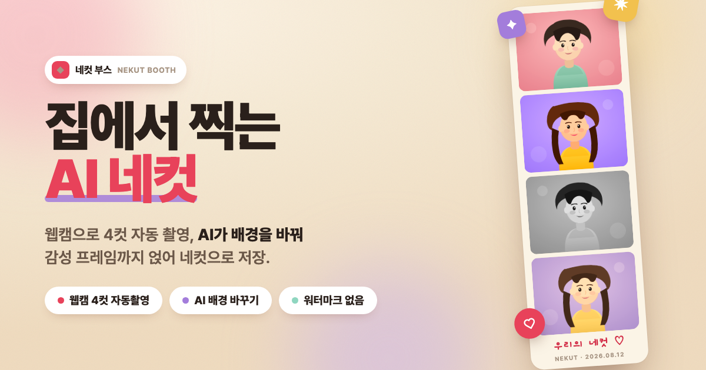
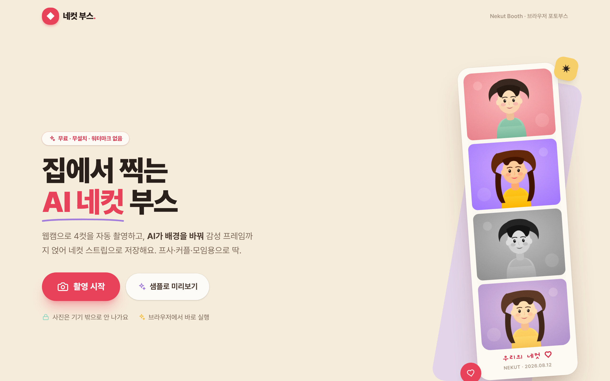
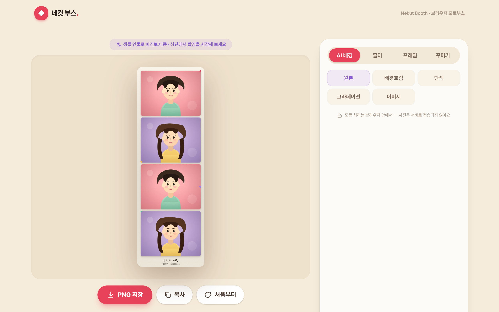
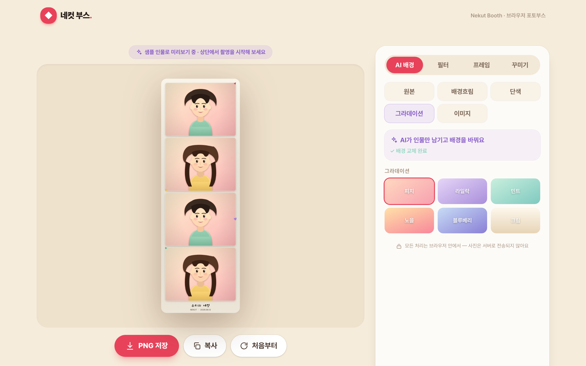

# 네컷 부스 (Nekut Booth)



> **집에서 찍는 AI 네컷** — 웹캠으로 4컷을 자동 촬영하고, AI가 배경을 바꿔 감성 프레임까지 얹어 네컷 스트립으로 저장하는 브라우저 포토부스.

<p>
  
  
  
  
  
</p>

## 🔗 라이브 데모

**https://nekut-booth.vercel.app**

한국의 "네컷사진" 문화를 집에서. 프사·커플·모임용으로 딱. **무료 · 무설치 · 워터마크 없음**, 그리고 **사진은 기기 밖으로 나가지 않아요.**

## ✨ 주요 기능

- 📸 **웹캠 4컷 자동 촬영** — 진짜 포토부스처럼 `3·2·1` 카운트다운 → 찰칵(플래시) → 다음 컷. 컷 사이에 포즈 바꿀 시간까지.
- 🔁 **컷별 재촬영** — 마음에 안 드는 컷만 눌러서 다시 찍기.
- 🪄 **AI 배경 바꾸기 (누끼)** — 촬영된 정지 4컷 각각에서 인물만 남기고 배경 교체. `단색 / 그라데이션 / 배경흐림(아웃포커스) / 이미지 업로드 / 원본유지`. 브라우저 안에서 RMBG 모델로 처리해요.
- 🎞️ **감성 필터** — 필름 · 웜톤 · 쿨톤 · 흑백 · 소프트 · 비비드. 라이브 프리뷰와 최종 저장에 동일하게 적용.
- 🖼️ **레이아웃 & 프레임** — 클래식 세로 4컷 스트립 / 2×2 그리드, 프레임 색상 7종, 하트·별·컨페티 스티커, 캡션·날짜.
- 💾 **고해상도 PNG 저장 & 클립보드 복사** — 파일명 `nekut-<날짜>.png`.
- 🧪 **웹캠 없이도 체험** — 내장 샘플 인물로 4컷·배경합성·프레임을 바로 미리보기. 권한 거부/미지원 시에도 폴백.

## 🔒 프라이버시

완전 프론트엔드 정적 앱입니다. 서버도, API 키도 없습니다. 카메라 프레임, 누끼 추론, 최종 합성까지 **모든 처리가 브라우저 안에서만** 일어나며 사진은 어디에도 업로드되지 않습니다. (AI 모델 가중치만 최초 1회 CDN에서 내려받습니다.)

## 🧠 AI 배경 교체는 어떻게?

실시간 영상 세그멘테이션(무겁고 끊김)이 아니라, **캡처된 정지 컷에만 고품질 누끼**를 적용합니다.

- 모델: [`briaai/RMBG-1.4`](https://huggingface.co/briaai/RMBG-1.4) via [`@huggingface/transformers`](https://github.com/huggingface/transformers.js)
- 실행: **WebGPU** 우선, 미지원 환경은 **WASM** 자동 폴백 + 다운로드 진행률 표시
- 라이브 프리뷰는 가벼운 웹캠 화면만, 누끼·배경합성은 4컷에만 → 부드러운 촬영 경험

## 🛠 기술 스택

- **React 19 + TypeScript** / **Vite 8**
- **Tailwind CSS v4** (`@tailwindcss/vite`)
- **@huggingface/transformers** (RMBG-1.4, WebGPU/WASM)
- Canvas 2D 파이프라인 (필터 · 누끼 배경합성 · 스트립 레이아웃 · PNG 인코딩)

## 🚀 로컬 실행

```bash
npm install
npm run dev
```

프로덕션 빌드:

```bash
npm run build && npm run preview
```

> 카메라는 `localhost` 또는 HTTPS에서만 접근할 수 있어요.

## 🧷 파이프라인 검증

합성·레이아웃·필터·누끼 배경합성 파이프라인을 DOM 최소 의존 순수 함수(`src/lib/photobooth.ts`, `src/lib/removeBg.ts`)로 분리해, 내장 샘플 이미지로 실경로를 자동 검증합니다.

```bash
npm run build && npm run preview   # 프리뷰 실행 후
node scripts/verify.mjs            # 스트립 해상도·무빈칸 + RMBG 실제 누끼→배경교체 스모크
```

## 📸 스크린샷

| 첫 화면 | 네컷 편집 | AI 배경 교체 |
| --- | --- | --- |
|  |  |  |

---

<sub>ⓒ 네컷 부스 · 한국 "네컷사진" 문화 기반의 일반 포토부스 앱입니다. 특정 업체 상표와 무관합니다.</sub>
